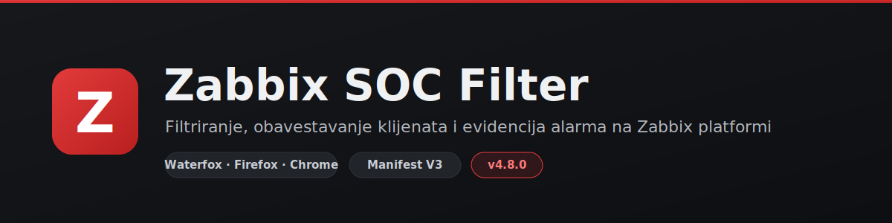
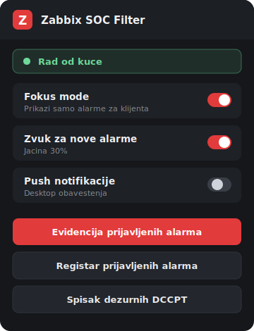
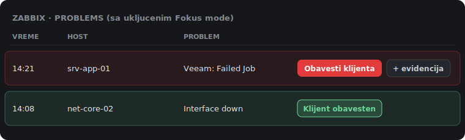
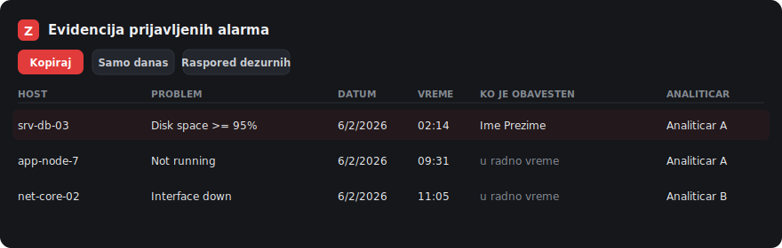

  

  Browser ekstenzija za SOC analitičare koja automatizuje obradu alarma na Zabbix platformi:
  filtriranje po internim pravilima, obaveštavanje klijenata u jednom kliku, acknowledge i automatsku evidenciju prijavljenih alarma.

  <b>Waterfox · Firefox · Chrome / Edge / Brave</b> &nbsp;·&nbsp; Manifest V3 &nbsp;·&nbsp; verzija 5.2.1

---

## Šta radi

- **Filtriranje alarma** - prikazuje samo alarme koje treba javiti klijentu, ostale stišava (blacklist / whitelist po internim pravilima).
- **Obavesti klijenta** - jedan klik otvara unapred formatiran mejl za odgovarajući tim (DCCPT, Networking, DevOps, DonDon), kopira sadržaj i šalje acknowledge u Zabbix.
- **Grupno obaveštavanje** - više alarma istog tima odjednom.
- **Označi pregledano** - acknowledge alarma koji se ne javljaju, sa komentarom „Seen by".
- **Evidencija prijavljenih alarma** - automatski vodi spisak alarma i priprema izvoz za SharePoint Registar (samo CT tenant).
- **Podsetnik na poziv** - van radnog vremena prikazuje primarnog i sekundarnog dežurnog sa brojem telefona.
- **Badge lokacije** - „Rad iz kancelarije" ili „Rad od kuće" po javnoj IP adresi.
- **Auto-update** - Waterfox/Firefox sami povlače nove verzije; Chrome uz ručni korak.

## Kako izgleda

Popup sa podešavanjima:

Na Zabbix Problems strani - crveni alarmi za javljanje i zeleni već obavešteni:

Evidencija prijavljenih alarma sa izvozom za Registar:

> Prikazi su ilustrativni, sa izmišljenim podacima.

## Instalacija

**Waterfox / Firefox / LibreWolf**

1. Preuzmi `zabbix-soc-filter.xpi` iz [releases](releases).
2. Otvori fajl ili ga prevuci u prazan tab, pa potvrdi instalaciju.
3. Nove verzije se povlače automatski (do 24h).

**Chrome / Edge / Brave**

1. Preuzmi `zabbix-soc-filter-chrome.zip` iz [releases](releases) i raspakuj u stalni folder.
2. Otvori `chrome://extensions/`, uključi Developer mode, pa Load unpacked i izaberi taj folder.
3. Folder mora ostati na istoj putanji. Nova verzija: skini novi ZIP, raspakuj preko postojećeg foldera, pa Refresh.

## Aktivacija

Pri prvom pokretanju klikni ikonu ekstenzije i unesi korisničko ime i token koji si dobio. Token se čuva lokalno u HMAC-SHA256 hash formatu, nikad u plain tekstu. Ime analitičara za „Seen by" se automatski izvodi iz korisničkog imena.

## Svakodnevno korišćenje

| Radnja | Kako |
| --- | --- |
| Uključi/isključi filter | Popup „Fokus mode" ili `Ctrl + Z` na Zabbix strani |
| Javi alarm klijentu | Crveno dugme „Obavesti klijenta" na redu |
| Javi više alarma | „Obavesti za sve" dole desno |
| Označi nealarmni red | „Označi pregledano" |
| Otvori evidenciju | Dugme „Evidencija prijavljenih alarma" u popup-u |

## Evidencija prijavljenih alarma

Dok je Zabbix otvoren, ekstenzija sama beleži alarme i dopunjava ih u trenutku javljanja. Na stranici evidencije: izvoz u TSV za direktan paste u Registar, filteri „Samo danas" i „Samo javljeni", uvoz rasporeda dežurnih i kontakata, te automatsko popunjavanje dežurnog za vanradne incidente (smena 08h - 08h). Radi isključivo na CT tenantu.

## Ažuriranje

Ekstenzija proverava novu verziju na svakih 60 sekundi. Waterfox/Firefox povlače automatski; Chrome zahteva ručno učitavanje. Ako se nova verzija ne primeni u roku od 48h, ekstenzija se zaključava dok se ne ažurira.

## Privatnost

Token se čuva isključivo lokalno, u hash formatu. Ekstenzija ne šalje podatke o alarmima nikuda osim u mejl koji ti sam otvaraš i u Zabbix acknowledge. Provera lokacije koristi samo javnu IP adresu.

## Kontakt

**Stefan Simović** · ssimovic@comtrade.com · [linkedin.com/in/simovicc](https://linkedin.com/in/simovicc)
